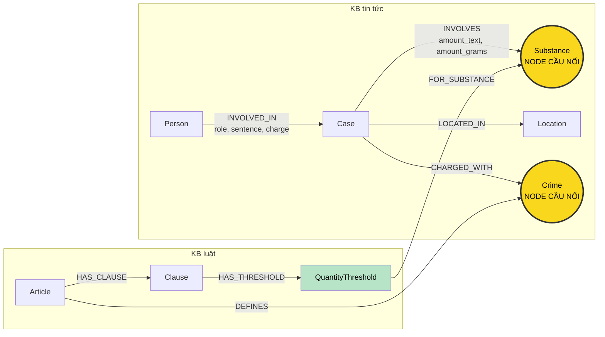

# Thiết kế Ontology — Day 19

**Họ tên:** Đinh Tiến Cảnh
**MSSV:** 2A202602918

**Lựa chọn:**

- [ ] Dùng ontology gợi ý
- [x] Tự thiết kế (xét bonus +15)

## 1. Sơ đồ

`Crime` là cầu nối chính cho Q3–Q4. `Substance` kết hợp với `QuantityThreshold` là cầu nối định lượng cho Q5 và khóa tổng hợp cho Q6.

## 2. Entity types (node labels)

| Label | Ý nghĩa | Khóa định danh (`MERGE` theo) | Properties | Lấy từ KB nào | Trích bằng |
| --- | --- | --- | --- | --- | --- |
| `Article` | Một điều luật | `id`, ví dụ `Điều 250 BLHS` | `title`, `law`, `doc_id` | Luật | metadata + regex |
| `Clause` | Một khoản trong điều luật | `id`, ví dụ `Điều 250 BLHS khoản 4` | `number`, `penalty`, `text`, `doc_id` | Luật | regex đầu dòng `1.`, `2.`… |
| `QuantityThreshold` | Ngưỡng định lượng tại một điểm của khoản | `id` = `{clause_id} điểm {point}-{substance_group}` | `point`, `min_grams`, `max_grams`, `min_inclusive`, `max_inclusive`, `amount_text`, `doc_id` | Luật | regex theo điểm và đơn vị |
| `Crime` | Tội danh chuẩn theo BLHS | `name` đã qua `normalize_crime` | `aliases` | Luật + tin | regex tiêu đề luật; LLM từ tin rồi `link_entity` |
| `Substance` | Chất/nhóm chất chuẩn | `name` chuẩn | `aliases` | Luật + tin | từ điển alias + regex/LLM |
| `Case` | Vụ việc được một bài báo mô tả | `id` = `{doc_id}#case-{index}` | `name`, `summary`, `date`, `source_title`, `doc_id` | Tin | LLM; `id` tạo bằng code |
| `Person` | Người liên quan vụ việc | `name_key` = họ tên chuẩn hóa | `name`, `aliases` | Tin | LLM + chuẩn hóa |
| `Location` | Địa điểm chính | `name_key` = tên chuẩn hóa | `name` | Tin | LLM + chuẩn hóa |

Quy ước `QuantityThreshold`:

- Đổi mọi khối lượng về gam (`1 kg = 1000 g`).
- “từ X đến dưới Y” dùng cận dưới đóng, cận trên mở.
- “X trở lên” có `min_grams=X`, `max_grams=null`.
- Giữ `amount_text` nguyên văn để truy vết và diễn đạt đúng luật.
- Tình tiết không định lượng vẫn nằm trong `Clause.text`, chưa tách node riêng.

Alias tối thiểu: `MDMA` ← “thuốc lắc”, “kẹo”, “viên lắc”; `Methamphetamine` ← “ma túy đá”, “hàng đá”; `Ketamine` ← “ketamin”, “ke”; `cần sa` ← “cannabis”. Tên mơ hồ như “nước vui” hoặc “ma túy tổng hợp” không bị đoán thành một chất cụ thể.

## 3. Relationships

| Type | Từ → Đến | Properties trên cạnh | Ý nghĩa |
| --- | --- | --- | --- |
| `DEFINES` | `Article` → `Crime` | không | Điều luật định nghĩa tội danh chuẩn |
| `HAS_CLAUSE` | `Article` → `Clause` | không | Điều luật chứa khoản |
| `HAS_THRESHOLD` | `Clause` → `QuantityThreshold` | không | Khoản có điều kiện định lượng |
| `FOR_SUBSTANCE` | `QuantityThreshold` → `Substance` | không | Ngưỡng áp dụng cho chất/nhóm chất nào |
| `CHARGED_WITH` | `Case` → `Crime` | không | Vụ việc liên quan tội danh |
| `INVOLVES` | `Case` → `Substance` | `amount_text`, `amount_grams` | Chất và lượng tang vật; số chuẩn chỉ có khi parse chắc chắn |
| `LOCATED_IN` | `Case` → `Location` | không | Địa điểm chính của vụ việc |
| `INVOLVED_IN` | `Person` → `Case` | `role`, `sentence`, `charge` | Vai trò, mức án và tội danh riêng của người |

Node sinh riêng từ một tài liệu (`Article`, `Clause`, `QuantityThreshold`, `Case`) có `doc_id = Document.id`. Node dùng chung (`Crime`, `Substance`, `Person`, `Location`) có thể liên kết nhiều tài liệu nên không gắn một `doc_id` duy nhất.

## 4. Node cầu nối giữa 2 KB

- **Node chính:** `Crime`.
- **Node phụ:** `Substance`; cùng `QuantityThreshold` và `INVOLVES.amount_grams`, nó nối lượng tang vật trong tin tới đúng khoản luật.
- **Lý do:** báo thường nêu hành vi/tội danh và chất; luật cũng có tội danh ở tiêu đề và chất tại các điểm định lượng. Chúng ổn định hơn tên vụ án.
- **Khớp `Crime`:** lấy danh sách chuẩn từ tiêu đề luật, đưa vào prompt, rồi chạy `link_entity` trên hai phía đã chuẩn hóa. Khớp chính xác trước, fuzzy `cutoff=0.8` sau; không đủ giống thì bỏ liên kết.
- **Khớp `Substance`:** chuẩn hóa Unicode, hoa thường và tra alias trước `MERGE`; ví dụ “thuốc lắc” nối vào `MDMA` khi ngữ cảnh xác nhận.
- **Khi cầu `Crime` gãy:** bài chỉ nói “hành vi”, LLM trả tên ngoài danh sách hoặc nhiều người có tội khác nhau. Xử lý bằng danh sách chuẩn trong prompt, `link_entity`, `charge` riêng trên `INVOLVED_IN`, và không tạo `Crime` mới từ chuỗi không khớp.
- **Khi cầu `Substance` gãy:** báo dùng tiếng lóng mơ hồ hoặc thiếu khối lượng. Vẫn giữ `amount_text`, chỉ tạo `amount_grams` khi đổi đơn vị chắc chắn và không dùng ngưỡng nếu thiếu số chuẩn.

## 5. Competency questions

| Câu | Đường đi (Cypher pattern) | Trả lời được? |
| --- | --- | --- |
| Q1 | `(:Article {law:'Luật Phòng, chống ma túy'})-[:HAS_CLAUSE]->(:Clause)`; lấy Article/Clause theo seed `doc_id`, trả `Clause.text` chứa “tiền chất” | Có; câu một KB, không cần cầu nối. |
| Q2 | `(:Person)-[r:INVOLVED_IN]->(:Case)` với case seed từ bài “36kg”, lọc `r.sentence='tử hình'` | Có; trả Trần Thanh Tuấn và Trần Minh Tâm. |
| Q3 | `(:Person {name:'Lê Minh Thành'})-[r:INVOLVED_IN]->(:Case)-[:CHARGED_WITH]->(:Crime)<-[:DEFINES]-(:Article)-[:HAS_CLAUSE]->(:Clause {number:1})` | Có; cạnh cho 36 tháng, Article cho Điều 251, Clause 1 cho 02–07 năm. |
| Q4 | `(:Person {aliases:['Hoàng Nato']})-[:INVOLVED_IN]->(:Case)-[:CHARGED_WITH]->(:Crime)<-[:DEFINES]-(:Article {id:'Điều 255 BLHS'})-[:HAS_CLAUSE]->(:Clause)`; lấy khung cao nhất | Có; trả hành vi, Điều 255 và mức tối đa tù chung thân. |
| Q5 | `(:Person {name:'Cái Quang Huy'})-[:INVOLVED_IN]->(k:Case)-[:CHARGED_WITH]->(:Crime)<-[:DEFINES]-(a:Article)-[:HAS_CLAUSE]->(cl:Clause)-[:HAS_THRESHOLD]->(t:QuantityThreshold)-[:FOR_SUBSTANCE]->(s:Substance {name:'MDMA'})` đồng thời `(k)-[i:INVOLVES]->(s)` và `i.amount_grams` thuộc `[t.min_grams,t.max_grams)` | Có; 9,6 kg = 9600 g khớp khoản 4 Điều 250. Đây là cải thiện trực tiếp. |
| Q6 | `(k:Case)-[:INVOLVES]->(:Substance {name:'MDMA'})`; trả `DISTINCT k` và `(p:Person)-[:INVOLVED_IN]->(k)` | Có; alias gom MDMA/thuốc lắc/kẹo khi ngữ cảnh xác nhận. |

## 6. Quyết định thiết kế và đánh đổi

1. **`QuantityThreshold` là node riêng.** Chỉ giữ `Clause.text` hoặc `MENTIONS` ngắn hơn nhưng không chứng minh được vì sao 9,6 kg MDMA thuộc khoản 4. Đổi lại cần regex đổi đơn vị và thêm node/cạnh.
2. **`Case.id = doc_id + chỉ số`, không dùng tên LLM.** Khóa xác định giúp build lặp lại không sinh trùng ngẫu nhiên. Đổi lại hai bài nói cùng một vụ vẫn là hai `Case`; lựa chọn này ưu tiên provenance và tránh gộp nhầm.
3. **Một `Substance` chuẩn có `aliases`.** `MERGE` nguyên chuỗi sẽ tách MDMA/thuốc lắc/kẹo. Đổi lại phải duy trì alias và tránh map tiếng lóng mơ hồ.
4. **Mức án nằm trên `INVOLVED_IN`.** Mỗi người trong cùng vụ có mức án khác nhau. Node `ProceedingEvent` đầy đủ hơn nhưng dữ liệu benchmark chưa cần độ phức tạp đó.
5. **Hai cầu nối bổ sung nhau.** `Crime` đủ cho Q3/Q4; `Substance` + ngưỡng cần cho Q5/Q6. Đổi lại Cypher và trích xuất phức tạp hơn.

## 7. So với ontology gợi ý (bắt buộc nếu xét bonus)

| Điểm khác | Gợi ý làm gì | Thiết kế này làm gì | Vấn đề nó giải quyết | Bằng chứng thực tế |
| --- | --- | --- | --- | --- |
| Mô hình hóa ngưỡng | `Clause-[:MENTIONS]->Substance`, ngưỡng chỉ trong text | `Clause-[:HAS_THRESHOLD]->QuantityThreshold-[:FOR_SUBSTANCE]->Substance`, cận số theo gam | Cho phép đối chiếu lượng bằng Cypher thay vì bắt LLM đọc toàn văn khoản | Graph thật có 222 `QuantityThreshold`; truy vấn Q5 trả `Điều 250 khoản 4 điểm b`, `min_grams=100`. Hai benchmark đều đạt Q5 recall 1.00/judge 2, nên cải tiến nằm ở khả năng giải thích và tính xác định, chưa làm tăng điểm Q5 trong lần đo này. |
| Khóa vụ ổn định | `Case` khóa theo tên LLM | `Case.id = doc_id#case-index`; tên chỉ để hiển thị | Tránh gộp nhầm và khóa thay đổi do cách LLM đặt tên | Graph đầy đủ có 14 `Case`; `MATCH (k:Case) RETURN count(k), count(DISTINCT k.id)` cho hai số bằng nhau. Constraint unique trên `Case.id` bảo vệ điều này khi build lại. |
| Alias chất | Khóa theo tên trích xuất | Tên chuẩn + `aliases`, chuẩn hóa trước `MERGE` | Gộp MDMA/thuốc lắc/kẹo vào một node để truy vấn tổng hợp | `MATCH (:Substance {name:'MDMA'})<-[:INVOLVES]-(k) RETURN DISTINCT k.name` tìm được các vụ MDMA. Tuy nhiên Q6 của bản tự thiết kế đạt recall 0.00/judge 1, thấp hơn HINT 0.67/1 vì context cuối không đưa tên người vào câu trả lời; đây là hạn chế cần sửa ở KG-3, không phải tách node chất. |
| Hai cầu nối | Cầu chính là `Crime`; chất chỉ được nhắc | `Crime` nối điều; `Substance` + ngưỡng nối định lượng | Cho phép vừa đi theo tội danh vừa kiểm tra điều kiện chất + lượng | Bản HINT có 201 node/382 cạnh; bản tự thiết kế có 419 node/645 cạnh. Đường Q3–Q4 dùng `Crime`; Q5 dùng thêm `Substance → QuantityThreshold` và trả đúng Điều 250 khoản 4. |

Hai file đo được nộp kèm: `ket_qua_benchmark_kg.hint.txt` cho ontology gợi ý và `ket_qua_benchmark_kg.txt` cho ontology tự thiết kế. Kết quả được giữ nguyên, kể cả Q6 bị giảm, để bằng chứng có thể kiểm chứng và không lựa chọn số liệu có lợi.

## 8. Hạn chế còn lại

- Hai bài cùng một vụ vẫn tạo hai `Case`. Chỉ thêm `SAME_AS` khi có quy tắc đối sánh đủ tin cậy.
- `Person.name_key` chưa giải quyết hoàn toàn người trùng tên hoặc tên viết tắt; corpus lớn cần thêm tuổi/địa chỉ.
- Parser đầu tiên chỉ xử lý gam, kilôgam và mẫu cận phổ biến. Quy đổi nhiều chất theo “tổng khối lượng tương đương” và thể tích cần logic riêng.
- Alias phụ thuộc ngữ cảnh; “kẹo” chỉ map MDMA khi bài hoặc giám định xác nhận.
- Chưa tách giai đoạn bắt, khởi tố, truy tố, sơ thẩm, phúc thẩm; `CHARGED_WITH` là quan hệ tổng quát.
- Q1 là câu định nghĩa một văn bản, nên vector retrieval vẫn hợp lý hơn graph.
